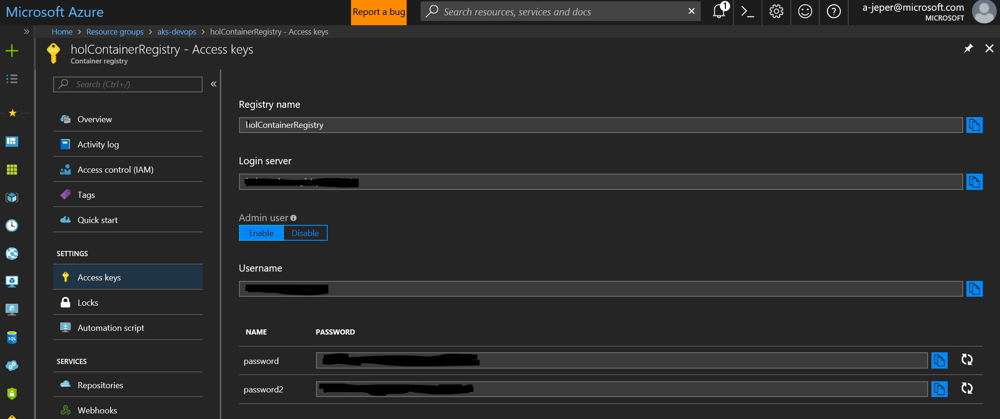
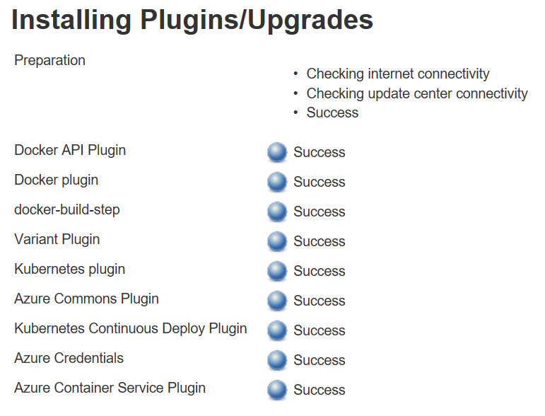

# Hands on Lab setup

# 1.Create a resource group
1. Open and login to Azure CLI 
2. Create a resource group to work 
```
az login 
az group create --name hol-containers-devops --location "West Europe"
```

# 2. Create an Azure Container Registry
1. Create Azure Container Registry in the same resource group created at step 1.
```
az acr create --resource-group hol-containers-devops --name holContainerRegistry --sku Standard
```
2. Go to Azure portal -> Resource groups -> hol-containers-devops -> holContainerRegistry -> Access Keys
3. Enable Admin user
 

# 3. Create an AKS Cluster
```
az provider register -n Microsoft.ContainerService
az provider show -n Microsoft.ContainerService
az group create --name hol-cluster-devops --location "West Europe"
az aks create --resource-group hol-cluster-devops --name aks --node-count 2 --node-vm-size=Standard_DS2_v2 --generate-ssh-key
```
Validate AKS Cluster
```
az aks get-credentials --resource-group hol-cluster-devops --name aks
kubectl get nodes
az aks browse --resource-group hol-cluster-devops --name aks
Browse to http://127.0.0.1:8001
```

# 4. Create an Agent VM - Jenkins

```
az vm create --resource-group hol-containers-devops --name agent --image UbuntuLTS --admin-username agentuser --generate-ssh-keys
```

## 4.1 Open ports
```
az vm open-port --resource-group hol-containers-devops --name agent  --port 3000-3001 --priority 1001
az vm open-port --resource-group hol-containers-devops --name agent  --port 8080 --priority 1002
```

## 4.2 Agent setup

1. Connect to the agent VM
```
ssh youruser@yourVMIP
```
2. Update Ubuntu packages and install Docker, Curl, nodejs and npm
```
sudo apt-get update && sudo apt install docker.io curl nodejs npm 
sudo apt-get upgrade 
```
3. Adding your user to Docker group
```
sudo usermod -aG docker $USER
```
4. Restart your terminal 
5. Confirm Docker, Nodejs and npm intallations
```
docker version
docker run hello-world
nodejs --version
npm -version
```
6. Install Kuberctl. For this example's purpose, follow [Install with snap on Ubuntu](https://kubernetes.io/docs/tasks/tools/install-kubectl/#on-linux-using-bash) 
```
sudo snap install kubectl --classic
kubectl version
```
7. Install Azure CLI. For this example's purpose, follow [Install with apt package manager](https://docs.microsoft.com/en-us/cli/azure/install-azure-cli?view=azure-cli-latest)
```
echo "deb [arch=amd64] https://packages.microsoft.com/repos/azure-cli/ wheezy main" | \
     sudo tee /etc/apt/sources.list.d/azure-cli.list

sudo apt-key adv --keyserver packages.microsoft.com --recv-keys 52E16F86FEE04B979B07E28DB02C46DF417A0893
sudo apt-get install apt-transport-https
sudo apt-get update && sudo apt-get install azure-cli
```

8. Install Jenkins. For this example's purpose, follow [steps 1,2 & 4](https://www.digitalocean.com/community/tutorials/how-to-install-jenkins-on-ubuntu-16-04)

```
wget -q -O - https://pkg.jenkins.io/debian/jenkins-ci.org.key | sudo apt-key add -
echo deb https://pkg.jenkins.io/debian-stable binary/ | sudo tee /etc/apt/sources.list.d/jenkins.list
sudo apt-get update
sudo apt-get install jenkins
sudo systemctl start jenkins
sudo systemctl status jenkins

sudo cat /var/lib/jenkins/secrets/initialAdminPassword
```

8.1. Unlock Jenkins
8.1.1. Browse to Jenkins web console and create an admin user 
8.1.2. Install suggested plugins
8.1.3. Add jenkins user to docker group
```
sudo usermod -a -G docker jenkins
sudo service jenkins restart
``` 

8.1 Install Docker and Kubernetes plugins

Go to Jenkins web console -> Manage Jenkins -> Manage Plugins -> Available and install without restart the next plugins:

 

9. Configure communication between Jenkins and Kubernetes cluster

```
az aks get-credentials --resource-group=hol-cluster-devops --name=aks
sudo mkdir /var/lib/jenkins/.kube/
sudo cp /home/agentuser/.kube/config /var/lib/jenkins/.kube/config

kubectl create secret docker-registry my-secret --docker-server=yourregistry.azurecr.io --docker-username=yourregistryuser --docker-password=yourpassword --docker-email=youremail@microsoft.com
```

