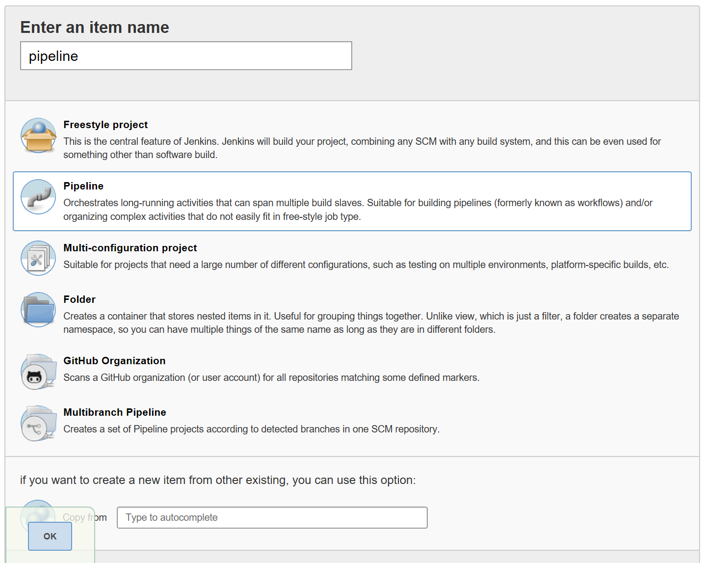
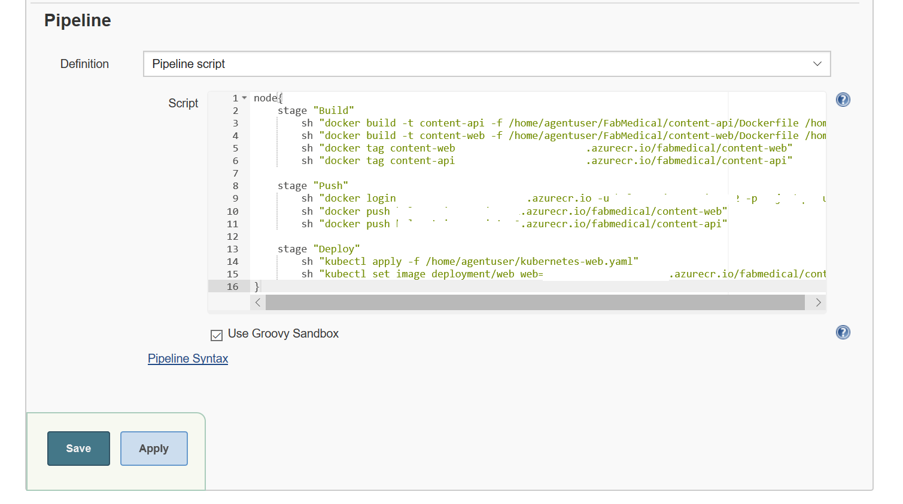
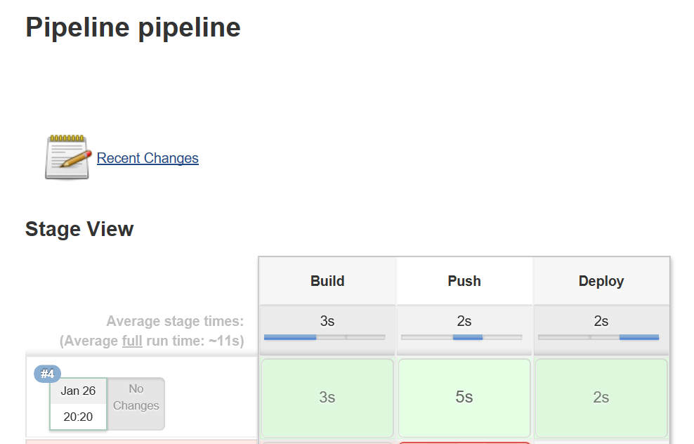
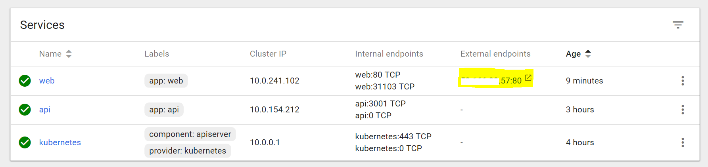
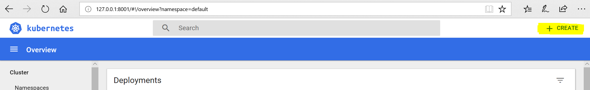
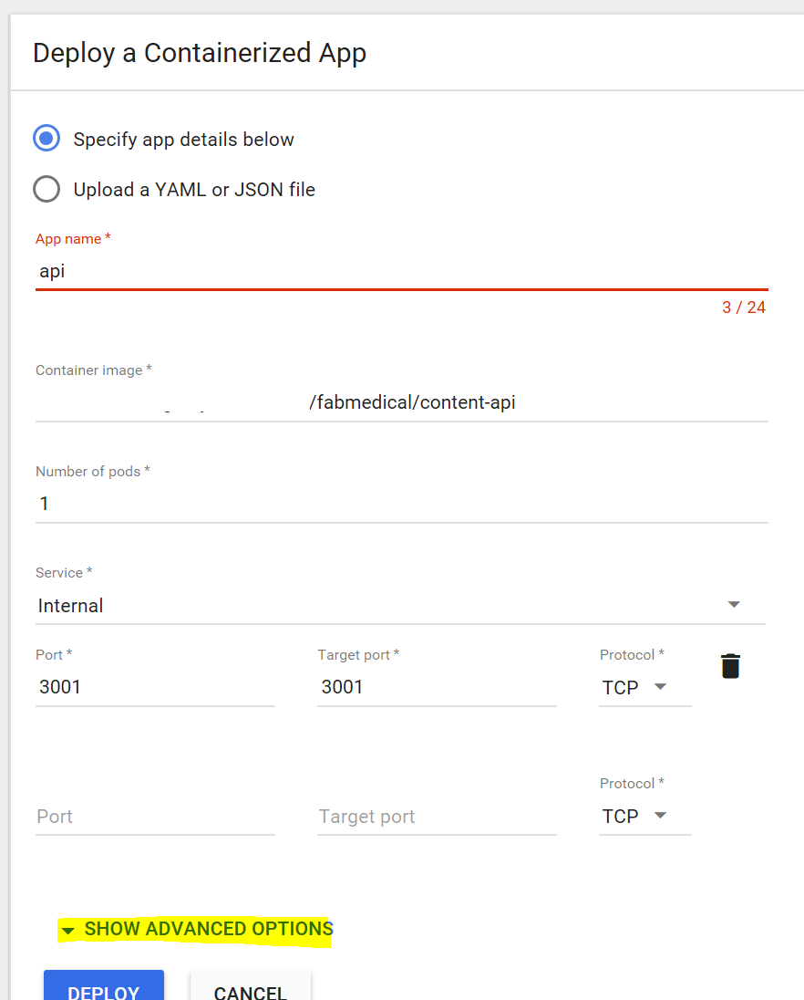
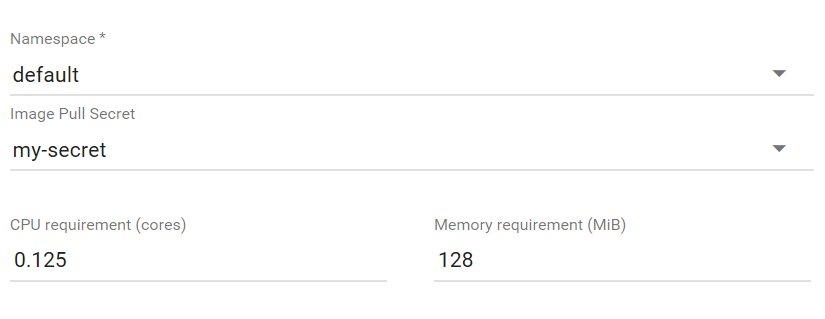
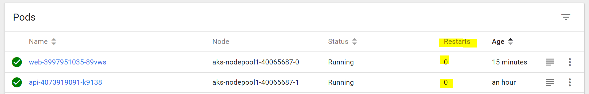
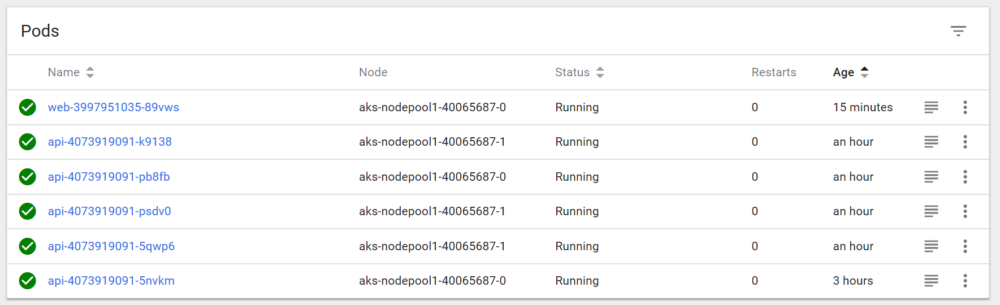
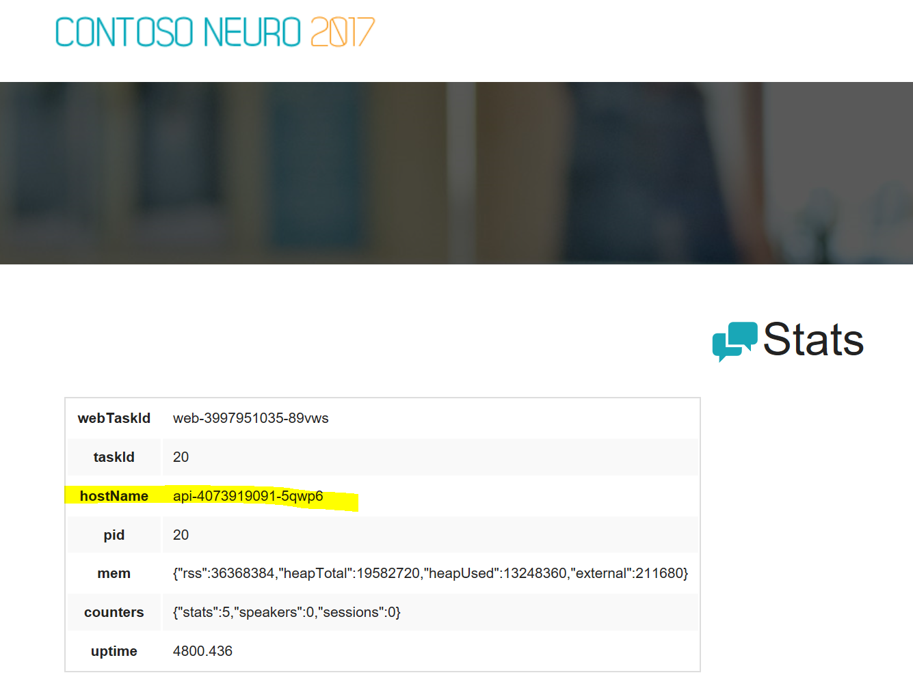

# Deployment

# 1. Deploy with Jenkins pipeline

1. Browse to Jenkins web console
2. Create a new item, pipeline type


3. Go to pipeline section 
4. Select pipeline script and fill in with the next code:
```
node{
    stage "Build"
        sh "docker build -t content-api -f /home/agentuser/FabMedical/content-api/Dockerfile /home/agentuser/FabMedical/content-api"
        sh "docker build -t content-web -f /home/agentuser/FabMedical/content-web/Dockerfile /home/agentuser/FabMedical/content-web"
        sh "docker tag content-web yourregistry.azurecr.io/fabmedical/content-web"
        sh "docker tag content-api yourregistry.azurecr.io/fabmedical/content-api"
    
    stage "Push"
        sh "docker login yourregistry.azurecr.io -u yourregistryuser -p yourpassword"
        sh "docker push yourregistry.azurecr.io/fabmedical/content-web"
        sh "docker push yourregistry.azurecr.io/fabmedical/content-api"
    
    stage "Deploy"
        sh "kubectl apply -f /home/agentuser/kubernetes-web.yaml"
        sh "kubectl set image deployment/web web=yourregistry.azurecr.io/fabmedical/content-web"
}

```



5. Save and Build Now


# 1.1 Valide the Deployment 
1. Browse to Kubernetes web console
```
az aks browse --resource-group hol-cluster-devops --name aks
Browse to http://127.0.0.1:8001
```
2. Go to Services


3. Browse to the Web's external endpoint


# 2. Deploy manually 
1. Browse to Kubernetes web console
```
az aks browse --resource-group hol-cluster-devops --name aks
Browse to http://127.0.0.1:8001
```
2. Create a new deployment


3. Fill the fields with:
App Name: api
Container Image: yourprivateregistry/imagename
Number of pods:  1
Service: Internal
Port: 3001
Target port: 3001



Open SHOW ADVANCED OPTIONS and fill fields with:
Namespace: default
Image Pull Secret: yourSecret
CPU: 0.125
Memory requirement: 128



4. Deploy

# 3. Validate pod's health
1. Browse to Kubernetes web console
```
az aks browse --resource-group hol-cluster-devops --name aks
Browse to http://127.0.0.1:8001
```
2. Go to Pods and validate no Restarts


# 4. Scale deployment
```
kubectl scale --replicas=5 deployment/api
```

1. In Kubernetes web console browse to Pods and see the new pods



2. Browse to /stats.html and update to verify all the pods deployed
